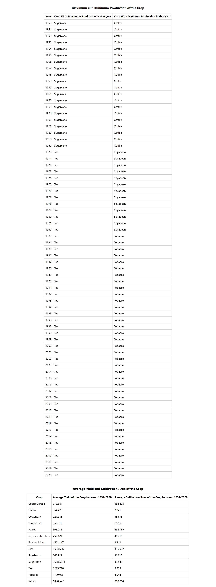

# Indian Agriculture Data Analysis

This project performs analytics on the Indian Agriculture dataset and displays the results in tables using React and Mantine.

## Table of Contents

- [Overview](#overview)
- [Setup Instructions](#setup-instructions)
- [Development](#development)
- [Build](#build)
- [Run](#run)
- [Screenshot](#screenshot)

## Overview

This project processes agricultural data from the National Data and Analytics Platform, NITI Aayog. It displays:
1. The crop with the maximum and minimum production for each year.
2. The average yield and cultivation area of crops between 1950-2020.

## Setup Instructions

### Prerequisites

- [Node.js]
- [Yarn]

### Installation

1. Clone the repository:

    ```sh
    git clone https://github.com/arumuga007/manufac-analytics-assignment.git
    cd manufac-analytics-assignment.git
    ```

2. Install dependencies using Yarn:

    ```sh
    yarn install
    ```

## Development

To start the development server:

```sh
yarn start
```
## Run

To run the react application:

yarn start

## screenshots:

Here is a screenshot of the application:


